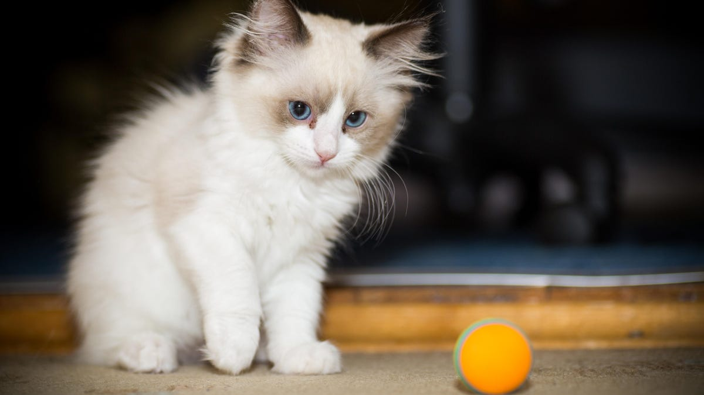

# Animal-Images-Classifier

Python API can classify an Base64 encoded image to determine if the animal in the image is wild animal or not.

## :star: Main Features:

* The API returns True if the animal in the image is not wild and returns false if the animal in the image is wild. 
* Using the generated public URL, an POST request can be sent that has a json body include the encoded image.
* The API using an image recognition model, get the animal name from the image.
* Using NLTK and the name recognised from the image, check if the animal in the image is a wild animal or not. 

## :camera: Test Cases

* using the generated public URL, ex: "https://b45dbd2667f8.ngrok.io"
* Request body in json format

```json
{ file : "encoded image" }
```
*
|image|Base64 equivalent|Request URL|Expected Output|
|---|---|---|---|
|<p align='center'></p>| <p align='center'>[here](https://github.com/Nada-Nasser/images-classification/blob/main/encoded_images/hen.txt)</p>| https://b45dbd2667f8.ngrok.io/classifyimage/ | <p align='center'>```True```</p>|
|<p align='center'></p>| <p align='center'>[here](https://github.com/Nada-Nasser/images-classification/blob/main/encoded_images/lion.txt)</p>| https://b45dbd2667f8.ngrok.io/classifyimage/ | <p align='center'>```False```</p>|
|<p align='center'></p>| <p align='center'>[here](https://github.com/Nada-Nasser/images-classification/blob/main/encoded_images/man.txt)</p>| https://b45dbd2667f8.ngrok.io/classifyimage/ | <p align='center'>```False```</p>|
|<p align='center'></p>|<p align='center'> [here](https://github.com/Nada-Nasser/images-classification/blob/main/encoded_images/cat.txt)</p>| https://b45dbd2667f8.ngrok.io/classifyimage/ | <p align='center'>```True```</p>|


